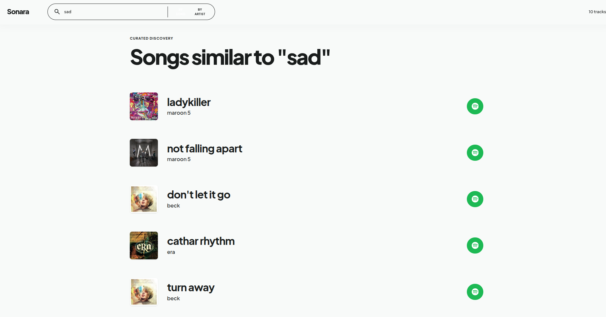
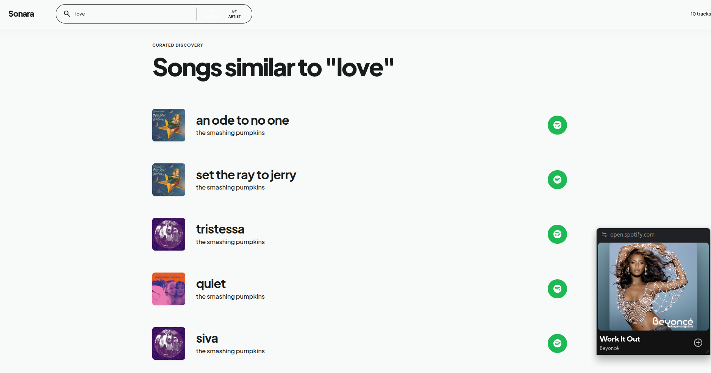
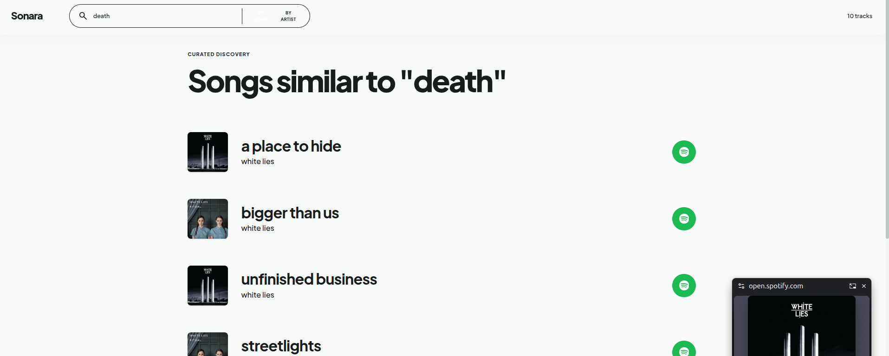

# 🔮 Hybrid Recommender System - Sonara

A hybrid music recommender system with a beautiful glassmorphic emerald UI.



### More Screenshots

Search by song:


Search by artist:


## 🎵 Sonara Music Discovery App

**Live Demo**: Run locally with the instructions below

### Features

- **Search by Song** - Find similar songs based on a track you like
- **Search by Artist** - Discover songs by your favorite artists
- **Real Album Art** - Fetches actual album covers from iTunes API (no API key needed)
- **Spotify Integration** - Click the Spotify button to open songs directly in Spotify
- **Beautiful UI** - Emerald green glassmorphic design with Plus Jakarta Sans typography

## 🎯 Project Goals

1. Songs dataset — contains information for all songs on the platform like attributes and metadata (content-based)
2. User-item interaction — user, song, playcount (collaborative); more playcount means higher preference

**Main goals:**
- Increase user engagement
- Increase user subscription retention
- Develop a more personalized and varied recommendation system

---

## 📁 Dataset

[Million Song Dataset (Spotify + Last.fm)](https://www.kaggle.com/datasets/undefinenull/million-song-dataset-spotify-lastfm)

---

## 🚀 Running Locally

### 1. Start the Backend

```bash
cd /path/to/project
source recom-env/bin/activate
uvicorn main:app --port 8005 --reload
```

### 2. Start the Frontend

```bash
cd frontend
npm install
npm run dev
```

The app will be available at `http://localhost:5173`

---

## 📊 Business Goal Metrics

1. **User Engagement**
   Free users listen to more songs due to personalized variety.
   After 3–5 songs, ads are shown; users can upgrade to ad-free subscription.

2. **CTR (Click-Through Rate)**
   If user is recommended 10 songs and selects the next song, it counts as 1 click.
   Goal: recommendations are loved and used by users.

3. **User Conversion**
   Higher engagement in free users leads to higher probability of converting to paid users.

4. **Lower Churn Rate**
   Retain users by constantly improving recommendations.

---

## ⚠️ Major Challenges

1. Dataset size: roughly 9.7 million records
   User-item matrix size (unique songs × unique users):
   - ~60k unique songs
   - ~1 million unique users
   - Matrix size ~28 GB — too large to load fully into memory

   **Solution:**
   - Use **chunking** to process data in parts

2. **Weight Assignment**
   - For old users, how to assign higher weight to collaborative filtering
   - For recent users, how to assign higher weight to content-based filtering

---

## 🛠️ Tech Stack

- **Frontend**: React + TypeScript + Tailwind CSS v4
- **Backend**: FastAPI + Python
- **Data**: iTunes API (for album artwork)

---

## 🎨 Design System

The UI follows "The Curated Soundscape" design philosophy:

- **Colors**: Rich emerald palette (#064E3B primary)
- **Typography**: Plus Jakarta Sans throughout
- **No borders**: Uses tonal layering for separation
- **Glassmorphism**: Frosted glass effects on nav and cards
- **Generous whitespace**: Editorial, unhurried feel
